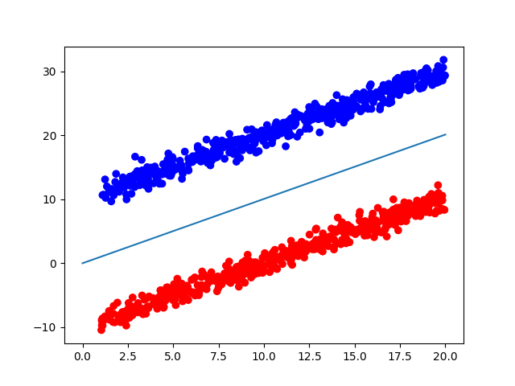

# Support Vector Machines
This folder contains implementation of an SVM which is a large margin classifier.

# Strategies for implementation
## SVM through origin using Quadratic programming
The SVM formulation states that we need to find the minimum value of ||x||^2/2 conditioned to y(t)((x^T)X(t)+b)>=1 for all t's where t is the t'th training sample and b is an offset for the svm. I consider a simplified version in which b is 0. Now the formulation of the SVM can be solved via Quadratic Programming. We set 
* P=Identity matrix
* q=null matrix
* the ith row of G would be defined as -y(i)X(i) where y(i) is training label of ith sample and X(i) is the vector input associated
* h=a column with all values -1

using the dataGen library and centering the data along two lines we get the following result.

